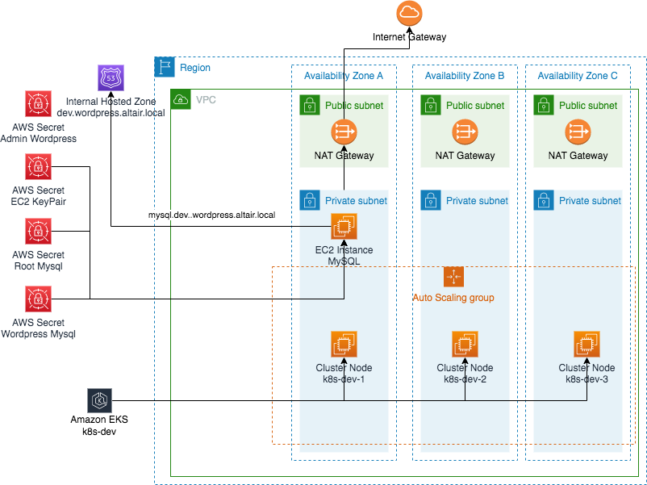
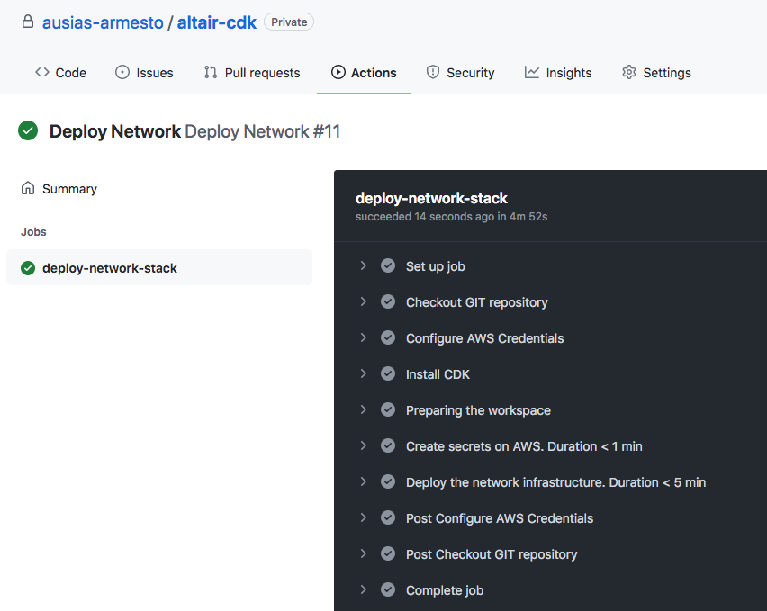
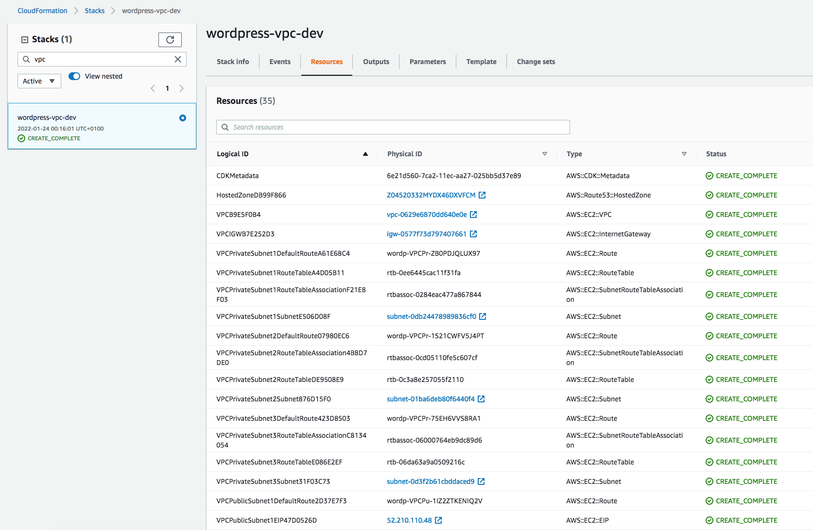
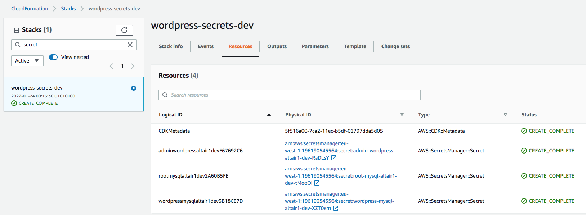
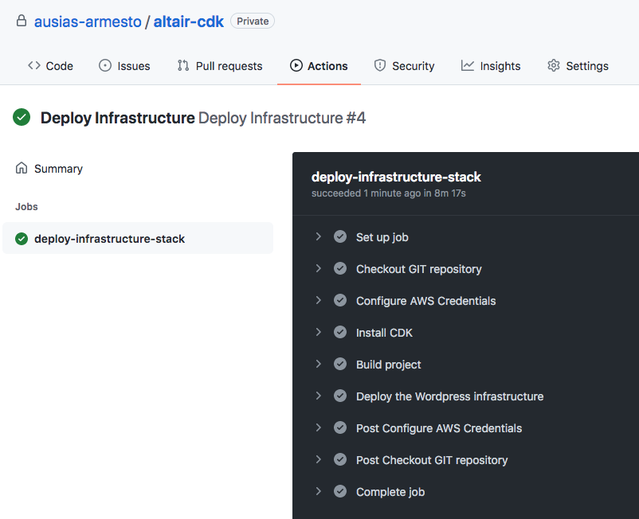
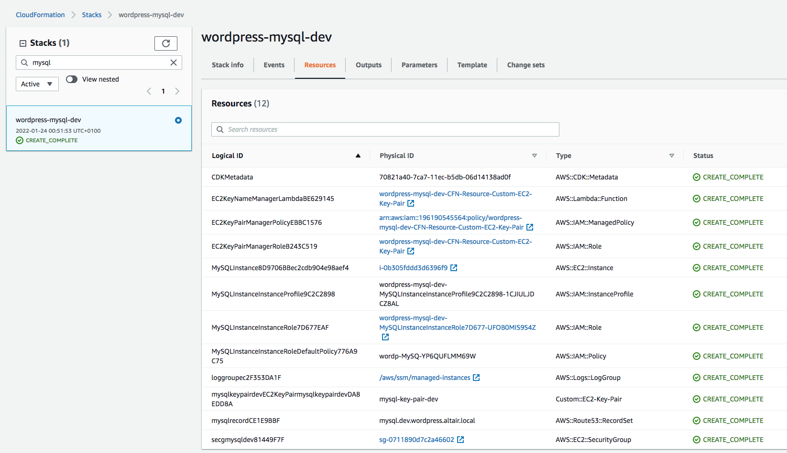
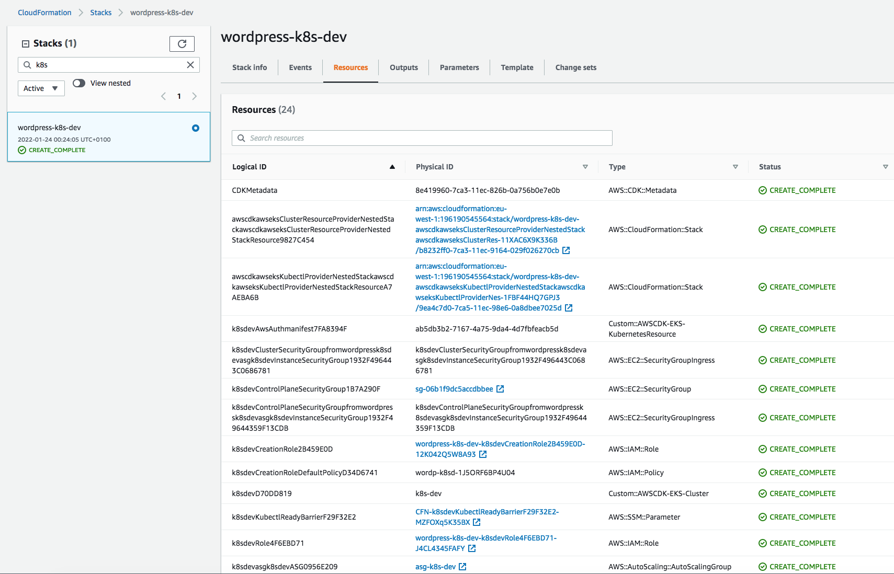

# Build Infrastructure with AWS CDK Cloudformation

## Prerequisites

- Installed AWS Cli 2.2.12
- Installed AWS CDK 2.8.0

## AWS Infrastructure

## Build Locally 

- `npm run clean`:  Removes generated files during compilation
- `npm run refresh`:  Regenerates the node_modules folder
- `npm run build`: Compile CDK typescript to Javascript
- `npm run test`: Perform the Jest Unit Tests
- `npm run deploy:secrets`: Deploys Wordpress Secrets
- `npm run deploy:network`: Deploys Network stack
- `npm run deploy:mysql`: Deploys Mysql stack
- `npm run deploy:kubernetes`: Deploys Kubernetes stack
- `npm run deploy:infrastructure`: Deploys All the stack
- `npm run kubernetes:config`: Updates the Kubernetes config file from the new generated cluster
- `npm run kubernetes:token`: Gets the EKS token from the new generated cluster

## Build on Github

See them on [Github Actions](https://github.com/ausias-armesto/uchicago-cdk/actions)

If you want to execute them as well on Github remind that you need to have configured on yor forked repository the secrets: _AWS_ACCESS_KEY_ID_ and _AWS_SECRET_ACCESS_KEY_ with its corresponding values to connect to AWS

- `Deploy Network`:  Install the Network and Secret Stacks
- `Deploy Infrastructure`:  Install the MySQL and EKS Stacks

## Screenshots

### Deploy Secrets and Network stack

### Deploy MySql and EKS stack

